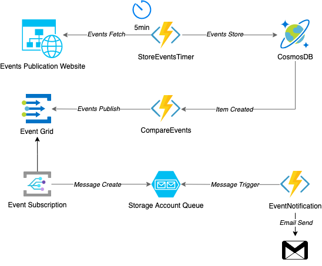

# Azure Cloud Native Demo

An overengineered event-driven event notification service using the following
Azure services:

* Functions
* CosmosDB
* Event Grid
* Storage Queue

## Goal

Demo for a cloud native implementation of what could be a implemented as a
cronjob in a simple script.

* Keep cost as low as possible.
* Use as many services as possible.

## Configuration

You must connect the functions GitHub repository.

Set the following variables in the function app settings:

* `GMAIL_PASSWORD`: Gmail application password
* `GMAIL_USERNAME`: Gmail username
* `NOTIFICATION_EMAIL`: Send notification to this email address

## Known issues

This demo has some known design and functional flaws:

* The _CompareEvents_ function is not really sophisticated. It could miss events
if new items are created in CosmosDB before the function is executed.
* Many things are hardcoded, e.g. Gmail
